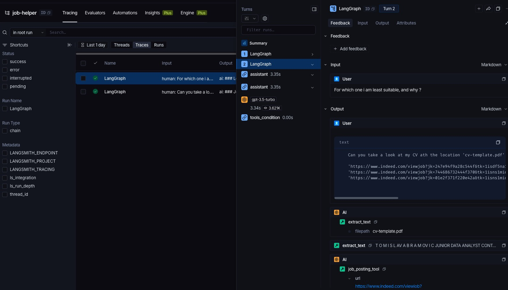

# Job Helper Agent

An LLM-powered career assistant that reads your CV, looks up job postings, and tells you how well you fit each role, with suggestions for improving your CV.

It is built as a LangGraph ReAct agent. The agent can call two kinds of tools:

- **CV text extraction:** reads a local PDF or DOCX CV.
- **Job posting lookup:** uses the OpenAI Responses API with web search to fetch a job posting URL and summarise it (title, company, salary, requirements, and so on).

## Project structure

The tools follow a ports-and-adapters layout, so an implementation (for example the PDF library or the LLM provider) can be swapped without touching the services or the agent.

```
config/             Settings loaded from environment / .env (pydantic-settings)
prompt_templates/   System and user prompts for the job-posting lookup
services/           Services that wrap the tools and expose them to LangChain (as_tools)
tools/
  ports/            Abstract interfaces (TextExtractor, LLMWebSearch)
  adapters/         Concrete implementations (pdfplumber, python-docx, OpenAI web search)
builder.ipynb       Notebook that builds and runs the LangGraph agent
```

## Requirements

- Python 3.12
- [uv](https://docs.astral.sh/uv/)
- An OpenAI API key
- Optional: a [LangSmith](https://smith.langchain.com) account, if you want to trace agent runs

## Setup

```bash
uv sync
```

Create a `.env` file in the project root:

```dotenv
# Required
OPENAI_API_KEY=sk-...

# Optional: LangSmith tracing
LANGSMITH_TRACING=true
LANGSMITH_API_KEY=lsv2_...
LANGSMITH_PROJECT=job-helper-agent
LANGSMITH_ENDPOINT=https://api.smith.langchain.com
```

`.env` is git-ignored. A real environment variable with the same name overrides the value in `.env`.

| Variable | Required | Description |
|---|---|---|
| `OPENAI_API_KEY` | Yes | Used by the chat model and the OpenAI web-search tool. |
| `LANGSMITH_TRACING` | No | Set to `true` to send traces to LangSmith. Leave it out or set it to `false` to turn tracing off. |
| `LANGSMITH_API_KEY` | When tracing | Your LangSmith API key. |
| `LANGSMITH_PROJECT` | No | The LangSmith project that runs are logged to. Defaults to `default`. The project is created automatically if it doesn't exist. |
| `LANGSMITH_ENDPOINT` | No | The LangSmith API URL. Defaults to `https://api.smith.langchain.com`. EU accounts use `https://eu.api.smith.langchain.com`. |

## LangSmith tracing

[LangSmith](https://smith.langchain.com) records each agent run: the LLM calls, tool calls, inputs and outputs, latency, and token cost. This helps when you're debugging the agent, for example to see why a job posting came back as unavailable.

1. Sign in at [smith.langchain.com](https://smith.langchain.com).
2. Go to **Settings → API Keys** and create an API key.
3. Add the `LANGSMITH_*` variables above to `.env`.
4. Run the notebook. Each `react_graph.invoke(...)` appears as a trace under your project in LangSmith. Functions decorated with `@traceable` show up as their own spans.



*A trace from a two-turn conversation. The middle panel shows each step of the graph (`assistant`, the model call, and `tools_condition`) with its timing and token count. The right panel shows the messages, including the `extract_text` and `job_posting_tool` calls the agent made.*

LangSmith reads these variables straight from the process environment. Unlike `OPENAI_API_KEY`, they don't go through `config/settings.py`, so `.env` has to be loaded into the environment before any LangChain code runs:

- **In the notebook,** the first cell does this for you:
  ```python
  %load_ext dotenv
  %dotenv
  ```
  If you change `.env`, restart the kernel so the new values are picked up.
- **In a Python script,** load it at the very top:
  ```python
  from dotenv import load_dotenv
  load_dotenv()
  ```
- **From the shell,** export the variables instead, for example `export $(grep -v '^#' .env | xargs)`.

Trace data (including your CV text and job-posting content) is sent to LangSmith. Turn tracing off with `LANGSMITH_TRACING=false` if you don't want that.

## Usage

Start Jupyter and open `builder.ipynb`:

```bash
uv run jupyter lab
```

The notebook:

1. Builds the text-extraction and job-posting services.
2. Wraps them as LangChain tools and binds them to the chat model.
3. Compiles a ReAct graph (assistant ⇄ tools).
4. Runs it with a question such as *"Here is my CV at `cv-template.pdf` and three job links. Which role suits me best?"*

`cv-template.pdf` is a sample CV you can use for testing.

## Limitations

- **Job boards may block automated access.** Indeed and similar sites often block bots, so a lookup can come back as "Job posting unavailable". When that happens, paste the job description text instead, or use postings hosted on Greenhouse, Lever, or company career pages.
- **Every lookup costs money.** Each job URL triggers a separate OpenAI web-search call.
